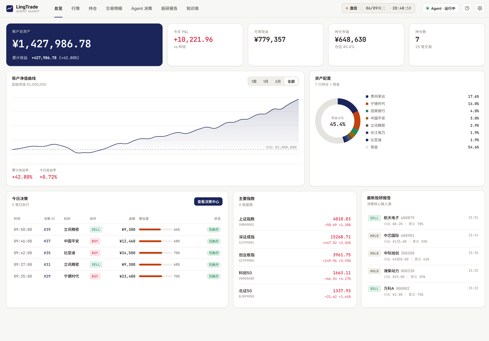
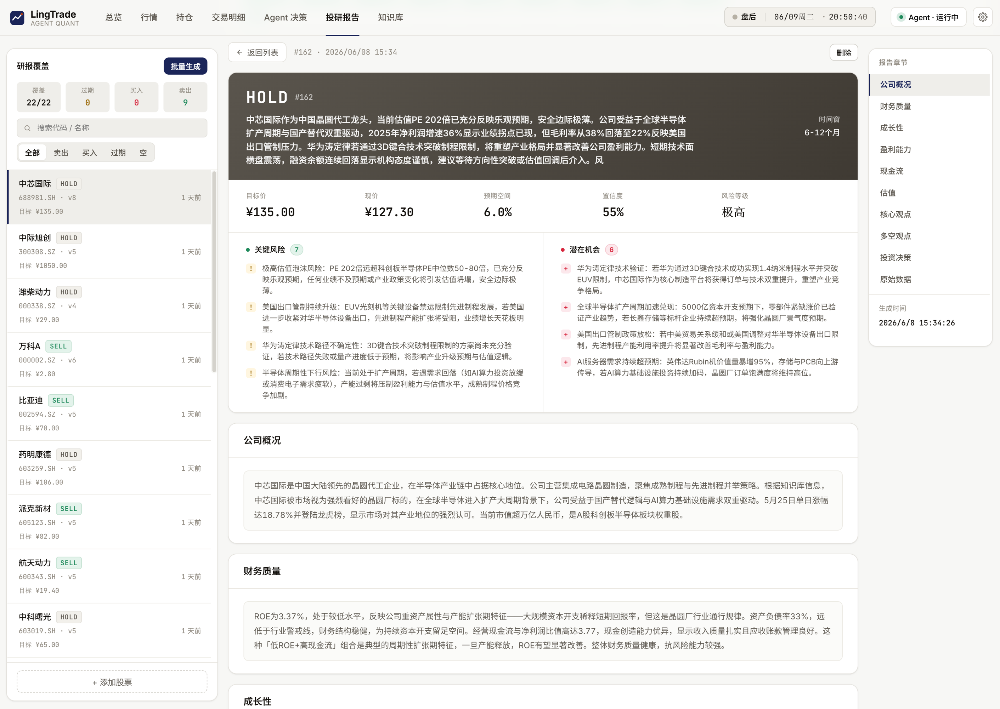
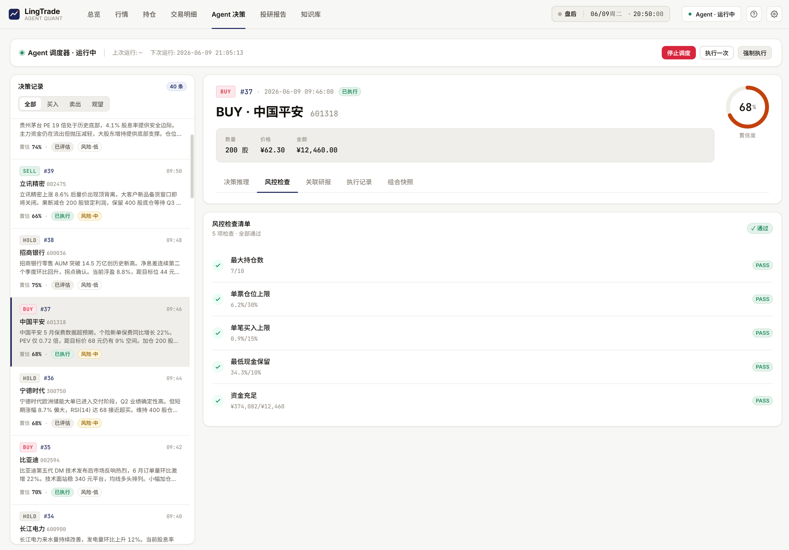
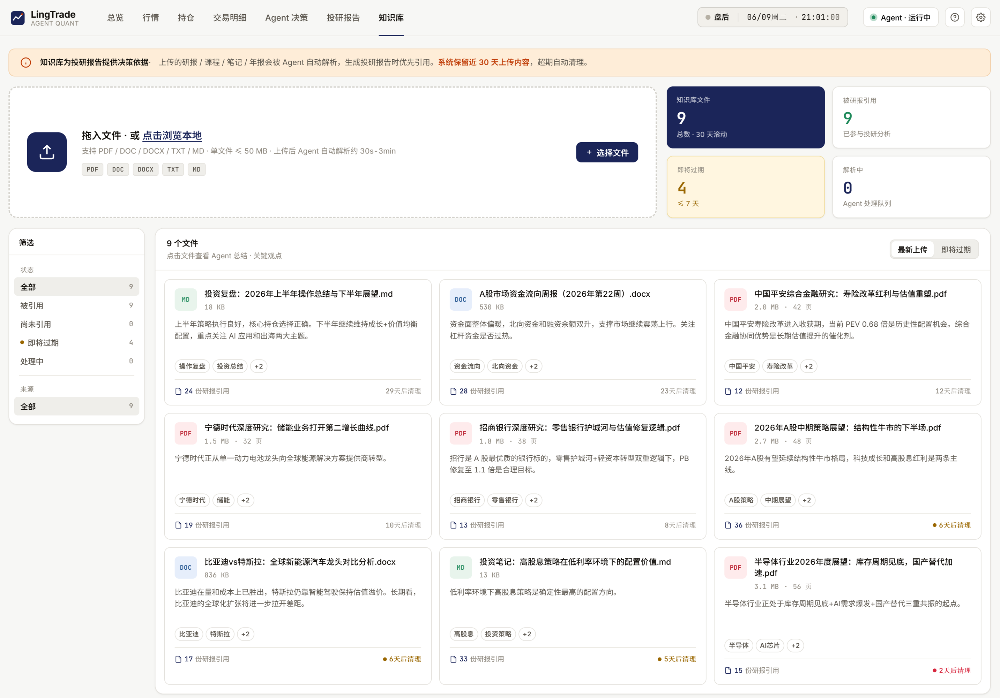
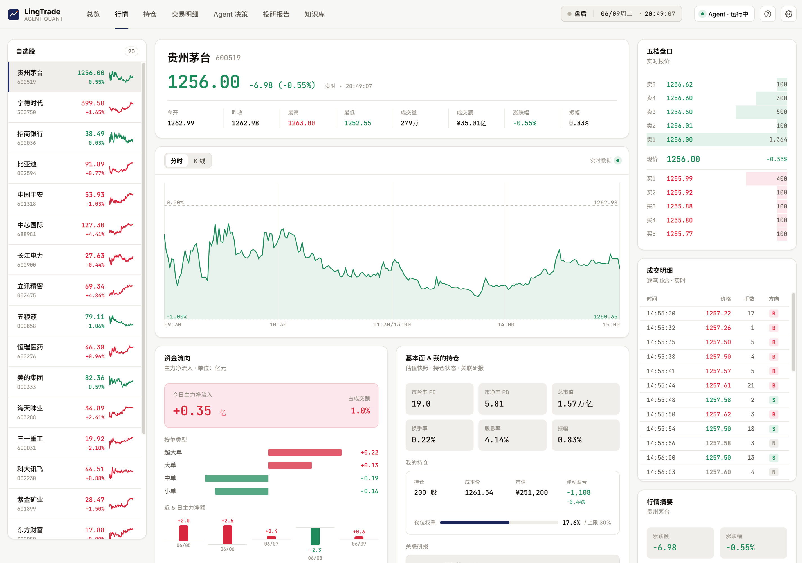
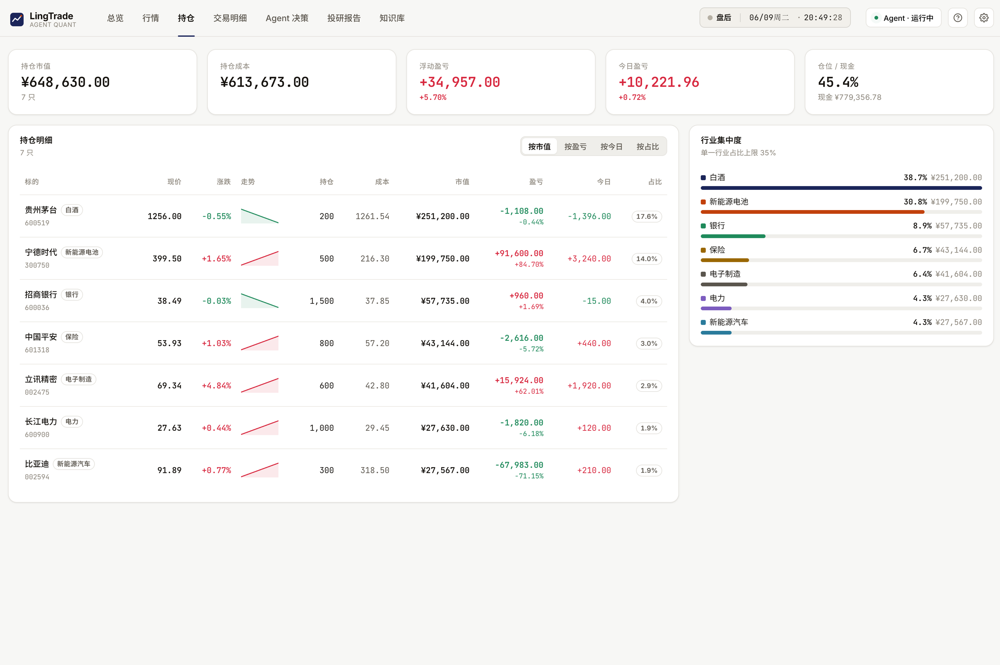

<div align="center">

# LingTrade

**界面优雅、决策透明和上手简单的开源 A 股 AI 投研工作站**

多智能体分析 · 模拟交易闭环 · 可自定义知识库 · 本地部署零云端依赖

[](LICENSE)
[](https://github.com/novalgo-x/LingTrade)
[](https://nodejs.org/)

<br/>



</div>

---

> [!CAUTION]
> **免责声明**
>
> 本项目仅供**学习、研究与技术交流**使用。
>
> - 所有行情数据均为**演示 / 模拟数据**，不保证准确性和实时性。
> - 所有 AI 生成的分析、评级、目标价、买卖标识均为**程序模拟输出**，不构成任何投资建议。
> - 本项目**不提供任何实盘交易功能**，不与任何券商或交易系统对接。
> - 使用者需**自行承担**基于本项目信息做出的一切决策风险。
> - 本项目**不面向中国大陆境内提供任何收费的证券投资咨询服务**。
>
> 默认数据源仅供个人学习自用，商业使用或再分发需用户自行确认上游授权。

> [!NOTE]
> **关于截图与演示数据**
>
> 本文档中的所有截图及项目内预置的账户数据、持仓记录、交易流水、Agent 决策、投研报告、净值曲线等内容均为**虚构的演示数据**，仅用于展示产品功能与界面效果。其中涉及的个股名称、价格、涨跌幅、分析结论等**不反映真实市场情况，不具备任何参考价值，不构成投资建议**。

---

## 核心特性

### 🔬 多智能体投研分析

由多个 AI Agent 协作完成投研全流程——从基本面扫描、技术面研判到风险评估，每一步分析均保留完整推理链路，研究过程完全透明可追溯。所有输出为模拟生成的研究性内容，帮助你理解 AI 分析的思考路径。

<div align="center">

</div>

### 📊 模拟交易闭环

从投研洞察到交易决策再到持仓跟踪，完整闭环在一个界面内完成。Agent 决策页逐笔展示买卖推理、风控校验与执行结果，每一个模拟交易动作都有据可查。

<div align="center">

</div>

### 📚 可自定义知识库

上传研报、笔记、行业资料，AI 自动解析摘要并纳入分析上下文。让你的个人研究积累真正参与到每一次投研决策中，构建属于你自己的投研知识体系。

<div align="center">

</div>

---

## 功能全景

LingTrade 的 Web 界面由七大模块组成，每个模块精心设计了信息层次与交互细节。

<table>
<tr>
<td align="center" valign="top" width="50%">
<br/>
<b>总览</b> — 账户资产、收益曲线、持仓分布、Agent 动态，一屏尽览。
</td>
<td align="center" valign="top" width="50%">
<br/>
<b>行情</b> — 分时走势、K 线图表、资金流向、核心财务指标。
</td>
</tr>
<tr>
<td align="center" valign="top" width="50%">
<br/>
<b>持仓</b> — 实时持仓明细、成本与盈亏、仓位占比一目了然。
</td>
<td align="center" valign="top" width="50%">
<br/>
<b>Agent 决策</b> — 每笔决策的推理过程、风控校验、执行结果完整留痕。
</td>
</tr>
<tr>
<td align="center" valign="top" width="50%">
<br/>
<b>投研报告</b> — AI 模拟生成的个股深度分析，含估值、风险、多空辩论。
</td>
<td align="center" valign="top" width="50%">
<br/>
<b>知识库</b> — 上传研报与笔记，AI 自动提炼要点，为后续分析提供上下文。
</td>
</tr>
</table>

<p align="center"><sub>以上截图中的所有数据均为虚构演示数据，不反映真实市场，不构成投资建议。</sub></p>

---

## 快速开始

### 环境要求

- **Node.js** >= 20
- **npm**

### 获取代码

```bash
git clone https://github.com/novalgo-x/LingTrade.git
cd LingTrade
```

### 安装与启动

> [!TIP]
> 安装脚本会自动检测网络环境：GitHub 直连不可用时，将自动切换到国内镜像（npmmirror）完成安装，无需任何手动配置。

#### macOS / Linux / WSL

```bash
bash scripts/install.sh   # 安装依赖
bash scripts/start.sh     # 后台启动前后端
bash scripts/stop.sh      # 停止
```

#### Windows

在 PowerShell 中运行：

```powershell
.\scripts\install.ps1     # 安装依赖
npm run dev               # 启动前后端（Ctrl+C 停止）
```

- 如提示「在此系统上禁止运行脚本」，改用：`powershell -ExecutionPolicy Bypass -File scripts\install.ps1`
- 如果安装过程异常缓慢或长时间卡住，可手动切换镜像源后重试：

  ```powershell
  npm config set registry https://registry.npmmirror.com
  Add-Content "$env:USERPROFILE\.npmrc" "better_sqlite3_binary_host_mirror=https://npmmirror.com/mirrors/better-sqlite3/"
  ```

  macOS / Linux 第二条对应：`echo 'better_sqlite3_binary_host_mirror=https://npmmirror.com/mirrors/better-sqlite3/' >> ~/.npmrc`

- 如果已安装 [Git Bash](https://gitforwindows.org/)，也可以直接使用上述 macOS / Linux 的 bash 脚本

---

启动完成后，打开浏览器访问：

```
http://localhost:26680
```

首次使用时会弹出新手向导，跟随指引即可完成基础配置。

---

## 架构简介

```
┌─────────────────────────────────────────────────┐
│                 浏览器 (React + Vite)             │
│            端口 26680 · 全部交互在此完成            │
└──────────────────────┬──────────────────────────┘
                       │ HTTP / API
┌──────────────────────▼──────────────────────────┐
│               Express 后端 (TypeScript)           │
│            端口 26681 · API 路由 + 业务逻辑         │
│  ┌──────────┐  ┌───────────┐  ┌───────────────┐ │
│  │ 模拟交易  │  │ 投研分析   │  │ 知识库 & 摘要  │ │
│  │ 账户/风控 │  │ Agent 编排 │  │ 文件解析/LLM  │ │
│  └────┬─────┘  └─────┬─────┘  └───────┬───────┘ │
│       │              │                │          │
│  ┌────▼──────────────▼────────────────▼───────┐  │
│  │          SQLite (better-sqlite3)           │  │
│  └────────────────────────────────────────────┘  │
└──────────────────────────────────────────────────┘
                       │
         ┌─────────────┼─────────────┐
         ▼             ▼             ▼
    Tushare API   雪球行情数据   LLM API
   (A 股基本面)   (实时行情)   (OpenAI 兼容协议)
```

全栈 TypeScript 构建。前端基于 React 19 + Vite，后端为 Express + SQLite，无需外部数据库。底层分析由 CLI 引擎驱动，与 Web 解耦，也可独立调用。所有 LLM 调用通过 OpenAI 兼容协议，可接入 DeepSeek、通义千问、Kimi、Claude、GPT 等主流模型。

---

## 配置说明

所有配置均可通过 Web 界面「设置」页面完成，也可编辑 `.env` 文件：

```bash
cp .env.example .env
```

### 数据源

| 配置项 | 说明 |
|--------|------|
| `TUSHARE_TOKEN` | Tushare 数据接口 token，用于获取 A 股基本面数据。不填则使用内置 mock 数据 |
| `TUSHARE_BASE_URL` | Tushare API 地址，默认 `http://api.tushare.pro` |

> 数据源仅供个人学习自用，商业使用或再分发需用户自行确认上游授权。

**Tushare 接口使用清单**：分析引擎按下表拉取数据，任一接口无权限或超出频次限制都**不会中断分析**——缺失项会在任务日志中给出原因提示，并作为数据盲区告知 AI，避免臆测。

| 接口 | 用途 |
|------|------|
| `daily` | 日线行情，技术面分析的基础 |
| `stock_basic` | 股票名称、所属行业 |
| `daily_basic` | PE / PB / 市值 / 换手率等估值指标 |
| `fina_indicator` / `income` / `cashflow` | 财务指标与利润表、现金流量表 |
| `forecast` | 业绩预告 |
| `moneyflow` | 个股资金流向 |
| `stk_holdertrade` | 股东增减持 |
| `top_list` / `top_inst` | 龙虎榜成交与机构席位 |
| `margin_detail` | 融资融券明细 |
| `stk_surv` | 机构调研记录 |
| `concept_detail` | 概念板块（官方 API 已下线该接口，仅部分第三方代理可用） |

> 各接口的积分要求与调用频次限制见 [Tushare 积分说明](https://tushare.pro/document/1?doc_id=290)。积分越高可用数据越全，低积分 token 也能完成基于日线行情的基础分析。

### 大模型 API

| 配置项 | 说明 |
|--------|------|
| `LLM_API_KEY` | 模型供应商 API Key |
| `LLM_BASE_URL` | API 端点，需兼容 OpenAI 协议 |
| `LLM_MODEL` | 默认模型名称 |

支持在 Web 界面中同时配置多个供应商，并为不同 Agent 角色（投研分析、交易决策、知识库总结）分配不同模型。

---

## 知识库

知识库支持上传个人研报、行业资料与研究笔记，AI 将自动解析内容并提炼摘要，作为后续投研分析的上下文参考。

**支持的文件类型：**

| 格式 | 说明 |
|------|------|
| `.pdf` | 研究报告、年报等 PDF 文档 |
| `.doc` / `.docx` | Word 文档 |
| `.md` | Markdown 笔记 |
| `.txt` | 纯文本文件 |

**解析机制：** 文件上传后由服务端解析提取文本内容（PDF 使用 `pdf-parse`，Word 使用 `mammoth`），随后调用 LLM 生成结构化摘要，存入 SQLite 供后续分析引用。

---

## Roadmap

- [ ] 多账户支持
- [ ] 回测引擎 — 基于历史数据验证策略表现
- [ ] 更多数据源适配
- [ ] 自定义 Agent 策略编排
- [ ] Docker 一键部署
- [ ] 移动端适配

欢迎通过 [Issues](https://github.com/novalgo-x/LingTrade/issues) 提出你的想法。

---

## 贡献指南

欢迎提交 Pull Request！参与贡献前请注意：

1. Fork 本仓库并创建你的特性分支
2. 确保代码通过类型检查（`npx tsc --noEmit`）
3. 提交 PR 时请说明改动目的与测试方式
4. 首次贡献需签署 [CLA（贡献者许可协议）](https://cla-assistant.io/novalgo-x/LingTrade)

---

## License

[AGPL-3.0](LICENSE)

本项目使用 GNU Affero General Public License v3.0 开源。简单来说：你可以自由使用、修改和分发，但基于本项目的修改版本在提供网络服务时也必须开源。

---

## 致谢

- [Tushare](https://tushare.pro/) — A 股数据接口
- [DeepSeek](https://www.deepseek.com/)、[通义千问](https://tongyi.aliyun.com/)、[Kimi](https://kimi.moonshot.cn/) — 国产大模型
- [React](https://react.dev/)、[Vite](https://vite.dev/)、[Express](https://expressjs.com/)、[better-sqlite3](https://github.com/WiseLibs/better-sqlite3) — 技术基础设施

---

## 交流

<div align="center">


扫码添加微信，备注 **LingTrade**，拉你进交流群。

</div>

---

<div align="center">

**LingTrade** — 研究、学习、模拟，让 AI 投研触手可及。

如果这个项目对你有帮助，欢迎 ⭐ Star 支持。

</div>
